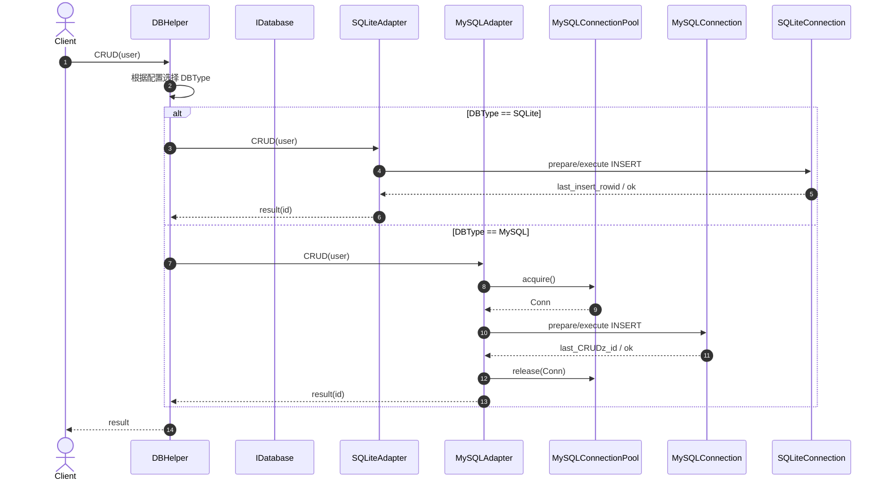

#Diagram

```mermaid
sequenceDiagram
  autonumber
  actor Client
  participant DBHelper
  participant IDatabase
  participant SQLiteAdapter
  participant MySQLAdapter
  participant Pool as MySQLConnectionPool
  participant Conn as MySQLConnection
  participant SQLite as SQLiteConnection

  Client->>DBHelper: CRUD(user)
  DBHelper->>DBHelper: 根据配置选择 DBType
  alt DBType == SQLite
    DBHelper->>SQLiteAdapter: CRUD(user)
    SQLiteAdapter->>SQLite: prepare/execute INSERT
    SQLite-->>SQLiteAdapter: last_insert_rowid / ok
    SQLiteAdapter-->>DBHelper: result(id)
  else DBType == MySQL
    DBHelper->>MySQLAdapter: CRUD(user)
    MySQLAdapter->>Pool: acquire()
    Pool-->>MySQLAdapter: Conn
    MySQLAdapter->>Conn: prepare/execute INSERT
    Conn-->>MySQLAdapter: last_CRUDz_id / ok
    MySQLAdapter->>Pool: release(Conn)
    MySQLAdapter-->>DBHelper: result(id)
  end
  DBHelper-->>Client: result
```
