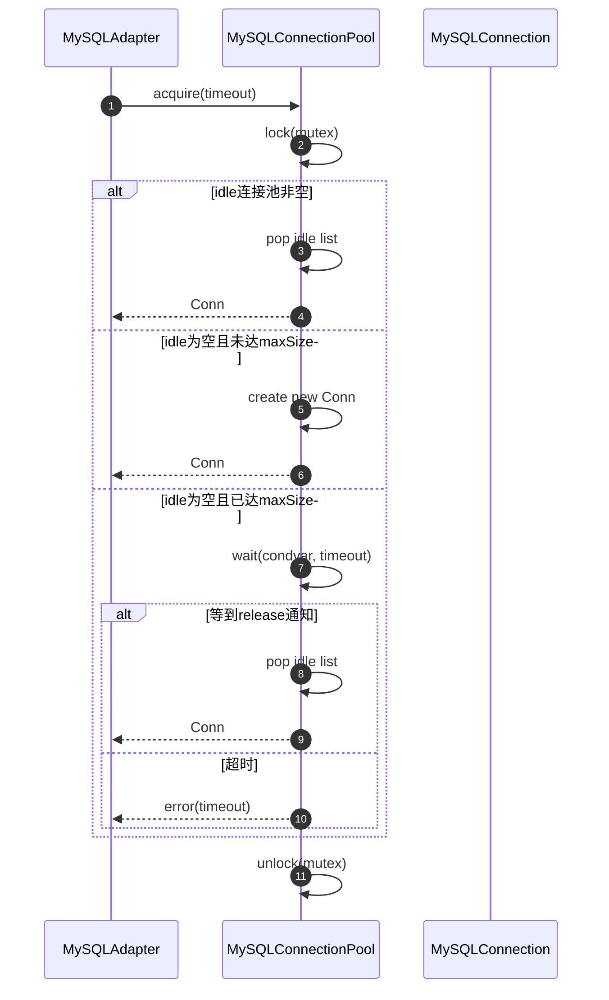

#connectionPool

```mermaid
sequenceDiagram
  autonumber
  participant Caller as MySQLAdapter
  participant Pool as MySQLConnectionPool
  participant Conn as MySQLConnection

  Caller->>Pool: acquire(timeout)
  Pool->>Pool: lock(mutex)
  alt idle连接池非空
    Pool->>Pool: pop idle list
    Pool-->>Caller: Conn
  else idle为空且未达maxSize
    Pool->>Pool: create new Conn
    Pool-->>Caller: Conn
  else idle为空且已达maxSize
    Pool->>Pool: wait(condvar, timeout)
    alt 等到release通知
      Pool->>Pool: pop idle list
      Pool-->>Caller: Conn
    else 超时
      Pool-->>Caller: error(timeout)
    end
  end
  Pool->>Pool: unlock(mutex)
```
