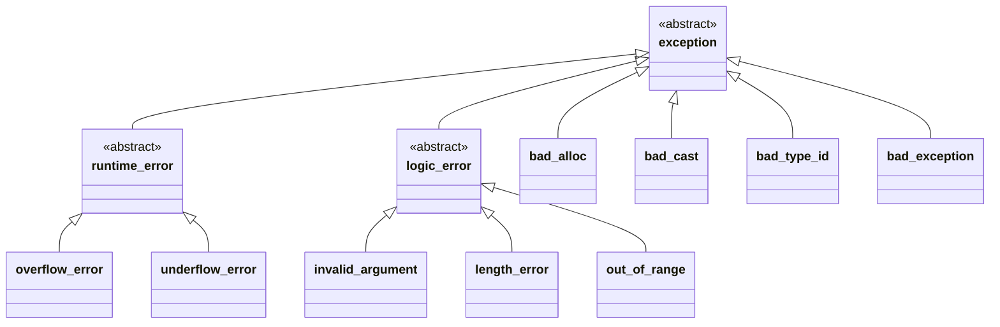

# 异常

> /home/tudong/projects/test_/c_cpp_/except/tmp_1.cpp


## 异常机制
> 传统的处理办法：将返回值表示函数调用是否正常结束


异常出发的过程：
    - 抛出异常后续的代码不会被执行
    - 局部对象会按照构造顺序相反的顺序自动销毁
    - 系统尝试匹配相应的catch 的代码段
      - 如果匹配则执行其中的逻辑，之后执行catch后续的代码
      - 如果不匹配则继续进行栈展开，直到“跳出”main函数，触发terminate结束运行

异常对象
    - 系统会使用抛出的异常进行拷贝初始化一个临时对象，称之为异常对象。
    - 异常对象会在栈展开过程中被保留，并最终传递给匹配的catch 语句。


## 续

### try-catch 语句块
try-catch 语句块
- 一个try语句块后面可以跟一个到多个catch语句块
- 每个catch语句块用于匹配一种类型的异常对象
- catch语句块的匹配按照从上到下进行
- 使用 catch(...) 匹配任意异常
- 在catch中调用throw继续抛出相同的异常

在一个异常未处理完成时抛出新的异常会导致程序崩溃
- 不要在析构函数或者operator delete 函数重载版本中抛出异常
- 通常来说，catch所接收的异常类型为引用类型

### 异常与构造、析构函数

- 使用 function-try-block 保护初始化逻辑
- 在构造函数中抛出异常
  - 已经构造的成员会被销毁，但是类本身的析构函数不会被调用


- 描述函数是否抛出异常
  - 如果函数不会抛出异常，则表明以为系统提供更多的优化空间
    - c++98 的方式：throw()/throw(int, char)
    - c++11 后的改进：noexcept/noexcept(false)      
  - noexcept
    - 限定符：接收true/false 表示是否会抛出异常
    - 操作符：接收一个表达式，根据表达式是否可能抛吃异常返回 false/true
    - 在声明了noexcept 的函数中抛出异常会导致terminate被调用，程序终止
    - 不作为函数重载依据，但函数指针、虚拟函数重写时要保持形式一致。

## 总结
1. 结构体、类会隐式的帮我们做很多事情，这块要整理总结出来，包括这部分学习的function-try-catch 的隐式 throw
2. 如果能够快速进入流心状态，或者状态切换，是不是修炼的能力又能上一个level


## 标准异常

### 标准异常



---


  
- 正确对待异常的处理
  - 不要滥用：异常的执行成本非常高
  - 不要不用：对于真正的异常场景，异常处理是相对高效、简洁的处理方式
  - 编写异常安全的代码


```c++
int *p = new int[1024];
throw 123;
delete []p;
```

发生异常，而造成内存泄露。

引申 
=== ==》避免资源裸的使用


