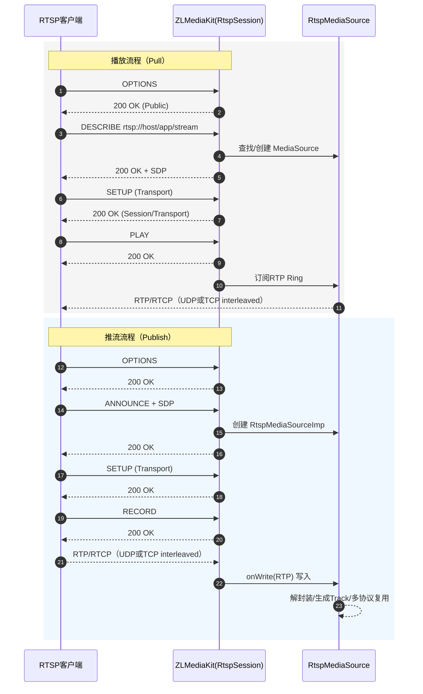

# rtsp


## ZLMediaKit 中的rtsp 流程，包括：服务器启动、推流、拉流、转换与分发

### 补充知识

RTSP 本身是控制协议，真正让"流能播放"的是两个关键要素：
    - SDP: 描述“流是什么”
    - RTP包: 承载“流的内容"
SDP(媒体会话说明书)
    其中包含了：
        - 有几路流(音频/视频)
        - 编码类型(H264/H265/AAC 等)
        - RTP 传输方式(UDP/TCP)
        - 端口/控制通道
RTP(真正的媒体数据)
    RTSP 只是发命令，真正的视频/音频内容是通过RTP 包发送的。
        - RTP 承载编码后的帧数据
        - RTCP 用于同步、统计、丢包反馈
RTSP 只是控制“平面”
 具体负责：
     - OPTIONS/DESCRIBE/SETUP/PLAY/TEARDOWN
     - 告诉服务端“我要这个流”
     - 协商RTP 传输方式

### 模块

```text
## 1. 服务器启动
main.cpp
    rtspSrv->start<RtspSession>(rtspPort, listen_ip);

## 2. rtsp 会话处理
src/Rtsp/RtspSession.h/.cpp

    解析rtsp 请求
    认证(rtsps)
    处理rtp/rtcp 输出输出
    把推流数据写入 RtspMediaSource

    关键函数:
        onWoleRtspPacket()    路由请求方法
        handleReq_ANNOUNCE()    推流SDP输入
        handleReq_DESCRIBE()    拉流端获取SDP
        handleReq_PLAY()        开始发送RTP
        onRtpPacket()           接收RTP(tcp interleaved)
        onRtcpPacket()          接收rtcp

### 3. 推流流程 rtsp publish

    客户端发ANNOUNCE(带SDP)
    RtspSession::handleReq_ANNOUNCE
        创建 RtspMediaSourceImp
    客户端 SETUP + RECORD
    RTP 包进来后
        onRtpPacket() -> onRtpSorted() -> 写入 RtspMediaSource

    关键类:
        RtspMediaSourceImp
            RtspDemuxer
            MultiMediaSourceMuxer
            onWrite
### 4. 拉流流程 rtsp paly

    客户端 DESCRIBE
        RtspSession::hadleReq_Describe() 返回 SDP
    客户端 SETUP -> PLAY
    RtspSession::sendRtspPacket()    从RtspMediaSource 的Ring 缓存读RTP 并发送
    RTCP 交互维持同步

### 5. 协议转换/多协议输出

    RtspMediaSourceImp 内部通过
    MultiMediaSourceMuxer 自动生成：RTMP、HLS、TS、F MP4、WebRTC

### 6. 相关组件速查
    RTSP 会话处理    RtspSession
    RTP 缓存与分发    RtspMediaSource
    推流端(向外推)    RtspPusher
    拉流端(从外拉)    RtspPlayer
    协议转换核心      MutilMediaSourceMuxer
```


## 流程图



## 总结

### 结构
    1. RTSP 客户端(负责与RTSP交互)
        src/Rtsp/RtspPlayer.h/.cpp
        继承 TcpClinet、RtspSplitter、RtpReceiver
    2. RTP 接收与排序
        src/Rtp/RepReceiver.h/.cpp
        RTP 序号排序、丢包处理、时间戳处理
    3. SDP解析与Track 建立
        src/Rtsp/RtspDemuxer.h/.cpp
        解析 SDP、构建音视频 Track
        src/Rtsp/Sdp.cpp 
    4. 媒体源接入(拉流+内部媒体源)
        src/Rtsp/RtspMediaSource.h/.cpp
        src/Rtsp/RtspMediaSourceImp.h/.cpp
        把RTP 数据写入 MediaSource
        触发多协议转换(RTMP/HLS等)
    5. 协议转换/输出
        src/Common/MultiMediaSourceMuxer.*
        将拉到的 RTSP 流变成 HLS/FLVR/RTMP等

### 开发问题
    1. RTP 乱序与丢包
        - UDP 传输容易乱序、丢包
        - 需要排序缓存、重传或容错策略
        - ZLMediaKit 中由RtpReceiver 处理
    2. NAT/防火墙问题
    3. SDP 不规范
    4. RTP 时间戳/同步问题
    5. 认证/鉴权
    6. 切换码流/断线重连
