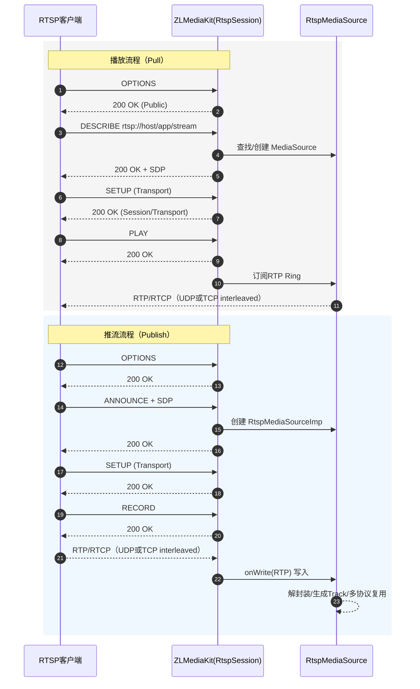

# rtsp


ZLMediaKit 中的rtsp 流程，包括：服务器启动、推流、拉流、转换与分发

```text
## 1. 服务器启动
main.cpp
    rtspSrv->start<RtspSession>(rtspPort, listen_ip);

## 2. rtsp 会话处理
src/Rtsp/RtspSession.h/.cpp

    解析rtsp 请求
    认证(rtsps)
    处理rtp/rtcp 输出输出
    把推流数据写入 RtspMediaSource

    关键函数:
        onWoleRtspPacket()    路由请求方法
        handleReq_ANNOUNCE()    推流SDP输入
        handleReq_DESCRIBE()    拉流端获取SDP
        handleReq_PLAY()        开始发送RTP
        onRtpPacket()           接收RTP(tcp interleaved)
        onRtcpPacket()          接收rtcp

### 3. 推流流程 rtsp publish

    客户端发ANNOUNCE(带SDP)
    RtspSession::handleReq_ANNOUNCE
        创建 RtspMediaSourceImp
    客户端 SETUP + RECORD
    RTP 包进来后
        onRtpPacket() -> onRtpSorted() -> 写入 RtspMediaSource

    关键类:
        RtspMediaSourceImp
            RtspDemuxer
            MultiMediaSourceMuxer
            onWrite
### 4. 拉流流程 rtsp paly

    客户端 DESCRIBE
        RtspSession::hadleReq_Describe() 返回 SDP
    客户端 SETUP -> PLAY
    RtspSession::sendRtspPacket()    从RtspMediaSource 的Ring 缓存读RTP 并发送
    RTCP 交互维持同步

### 5. 协议转换/多协议输出

    RtspMediaSourceImp 内部通过
    MultiMediaSourceMuxer 自动生成：RTMP、HLS、TS、F MP4、WebRTC

### 6. 相关组件速查
    RTSP 会话处理    RtspSession
    RTP 缓存与分发    RtspMediaSource
    推流端(向外推)    RtspPusher
    拉流端(从外拉)    RtspPlayer
    协议转换核心      MutilMediaSourceMuxer
```



