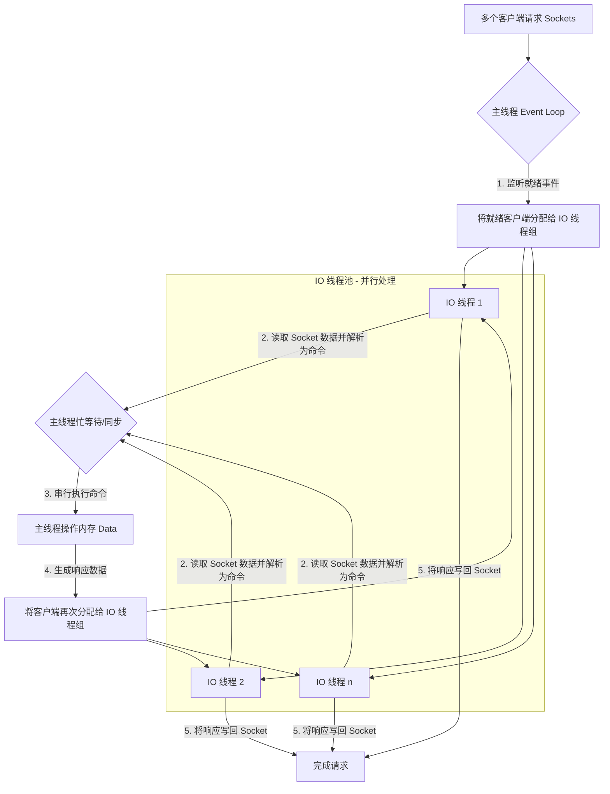
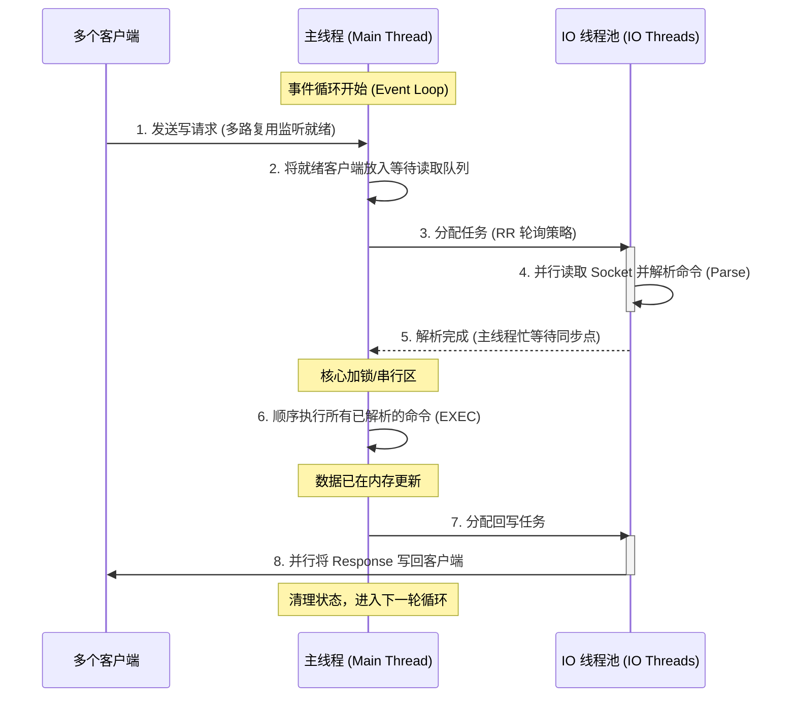

# redis 源码分析

## 流程图

1. Redis 6.0 多线程处理流程图

2. 多线程协作时序图

3. 核心机制总结
阶段性同步：主线程在每个步骤（读、写）都会等待所有 IO 线程完成后才继续下一步，这种 “走走停停” 的设计确保了命令执行的顺序性。
写请求处理：对于你提到的多个写请求，它们会被 IO 线程并行解析，但在步骤 6 中，主线程会像单线程版本一样，逐条执行这些写操作，确保内存数据的线程安全。
性能提升：虽然执行还是单线程，但由于网络 IO（往往占总耗时的 50% 以上）被分担了，Redis 6.0 的吞吐量在多核机器上通常能提升 2 倍以上。
